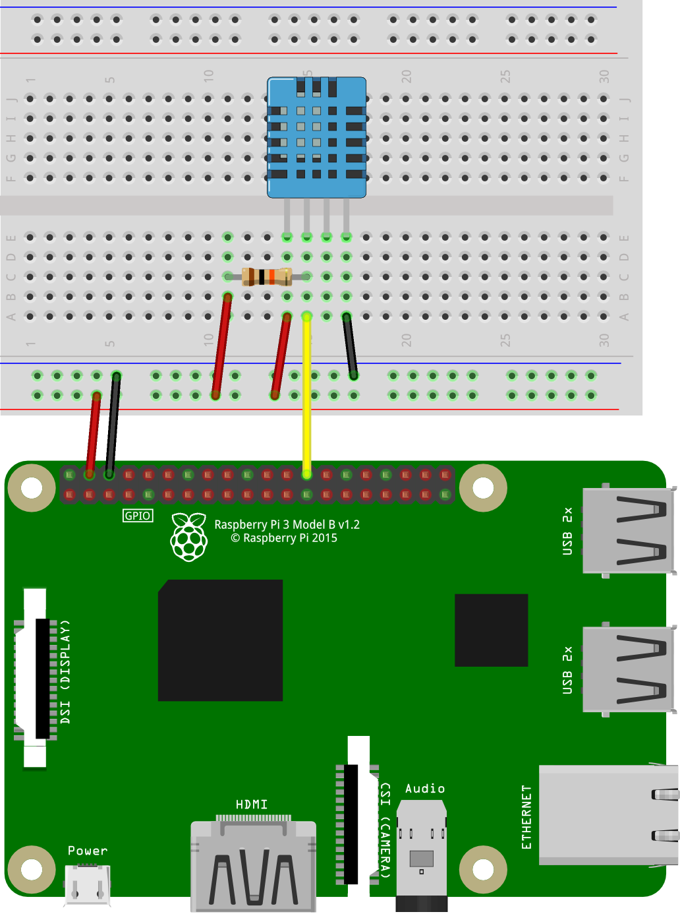

# Basic Configuration
This example shows the Raspberry Pi connected to the DHT11 temperature and humidity sensor. The sensor is powered by 5V and communicates with the Pi via Pin 26.

There is a pullup resistor from the data pin of the sensor to 5V. It is needed for proper communication. Some of these sensors come with an internal pullup, but it does not hurt to add another.

More information can be found at the [Adafruit webpage](https://learn.adafruit.com/dht).

