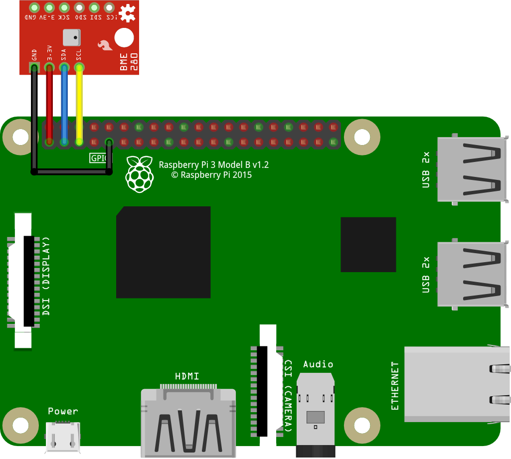

# BME Sensor
In this example, the Raspberry Pi is connected directly to a breakout board for the BME280 sensor from Sparkfun. The BME280 sensor can be used to measure ambient temperature, humidity, and pressure. It interfaces to the Raspberry Pi via either I2C or SPI. This example uses I2C. It is a direction connection, and no other components are needed.

Usage is documented extensively in SparkFun's [hookup guide](https://learn.sparkfun.com/tutorials/sparkfun-bme280-breakout-hookup-guide).

