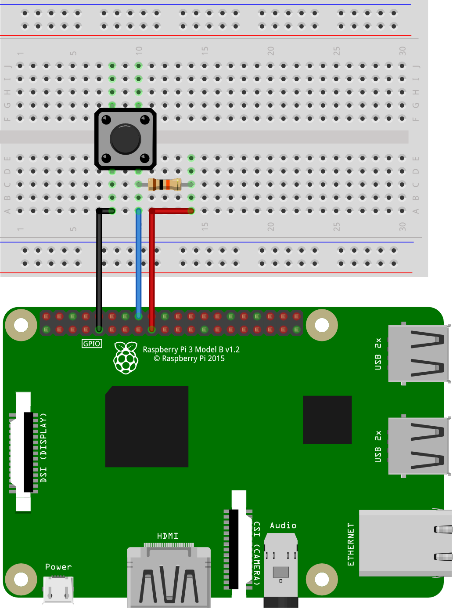

# Button
In this example, a button is connected to GPIO 23 of the Raspberry Pi. This tactile switch can be used a digital input to the MudPi control strategy. A 10 kΩ pullup resistor is also included. When the button is not depressed, this resistor pulls up the voltage of GPIO 23 to 3.3 V. When the button is pressed, the voltage is pulled down to 0 V. Adafruit has a [tutorial about switches and pull up resistors](https://learn.adafruit.com/make-it-switch/hook-up-your-switch).

Note some form of debouncing should be used to ensure button presses are recording accurately. When the button is pressed, the voltage at the pin will oscillate briefly between the two states before settling. Debouncing is the process of ignoring this oscillation and reading steady values. Debouncing can be done in hardware or software. For software debouncing, it is common to check the state of the digital input repeatedly a finite number of times. Only when the reading is stable for successive readings will the new input be considered. Adafruit has a [debouncing example](https://learn.adafruit.com/make-it-switch/debouncing) with code. Hardware debouncing may involve RC filters, Schmitt triggers, diodes, or any combination of the above. The specific strategy used is application depenedent.

