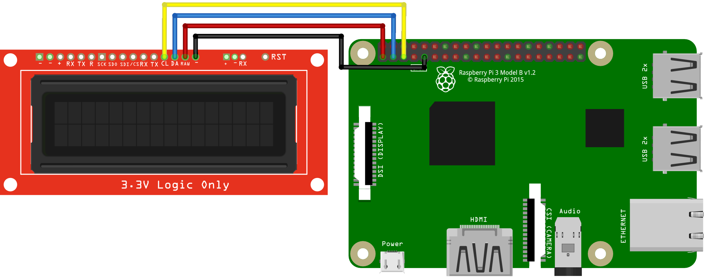

# Character Display
In this example, the Raspberry Pi is connected directly to an LCD display from Sparkfun. This particular display has a microcontroller onboard to accept I2C (and other serial protocol) commands. No other supporting components are needed.

Usage is documented extensively in SparkFun's [hookup guide](https://learn.sparkfun.com/tutorials/avr-based-serial-enabled-lcds-hookup-guide).

