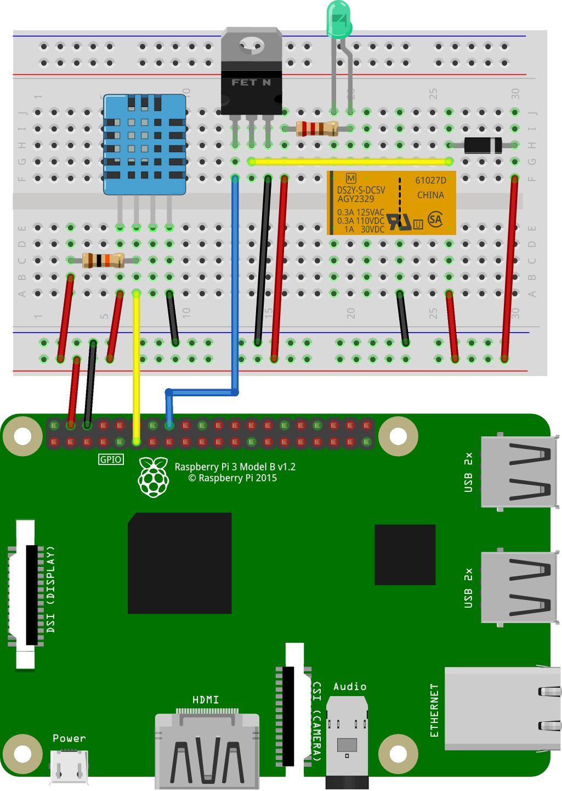

# Relay
This example is a combination of the relay and basic configuration examples. The DHT sensor has been moved to GPIO 17 for clearer wiring. Also an LED has been added as the relay load. A 220 Ω current limiting resistor is in series with the LED. This relay can handle much more current than is needed by a small, indicator LED. A variety of differnet LEDs or lamps could be used instead. A specific current limiting resistance would need to be calculated for different LEDs.

