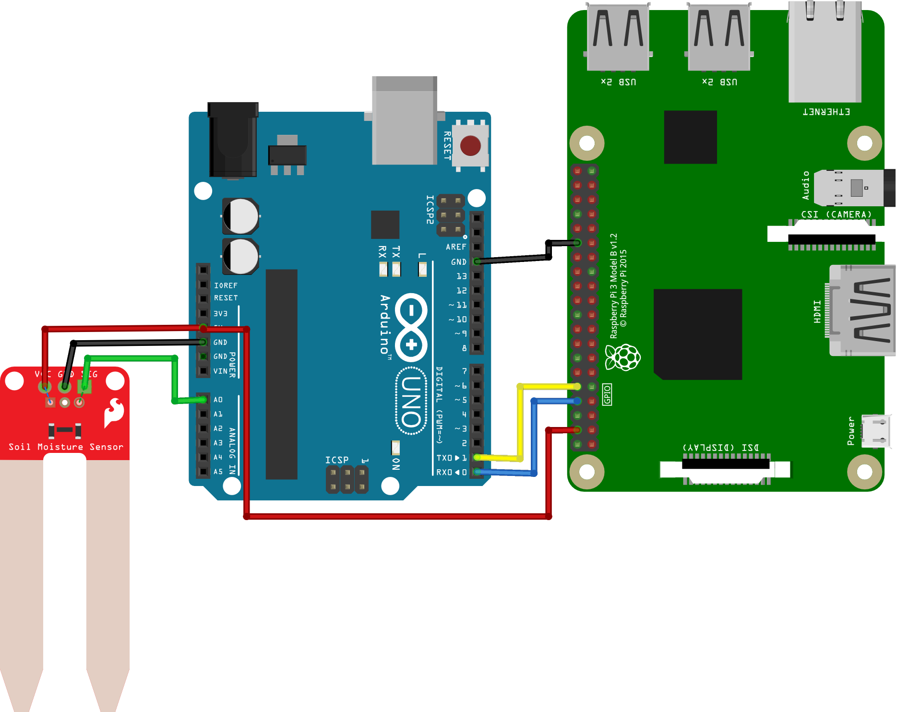

# Serial Node
This example shows a sensor node connected to the Raspberry Pi via a wired serial connection. The node is an Arduino Uno development board. The Arduino has a soil moisture sensor attached. The serial connection between the boards is realized using GPIO pins on both boards. An alternative method would be to use a USB to TTL converter to utilize one of the USB ports of the Raspberry Pi.

This soil moisture sensor is from Sparkfun. They provide a  for reference. This is a resistive soil moisture sensor that provides an analog output to represent the moisture. It is powered by 5V. It could also be powered by a GPIO pin to selectively turn the sensor on and off to prevent corrosion. An analog pin of the Arduino is used to read the measurement. Note there are capacitive soil moisture sensors as well.  sells a sensor of this type. It also has an analog output, so it interfaces to the Arduino in a similar fashion. Consdier adding an RC filter to the analog input for anti-aliasing and node rejection.

